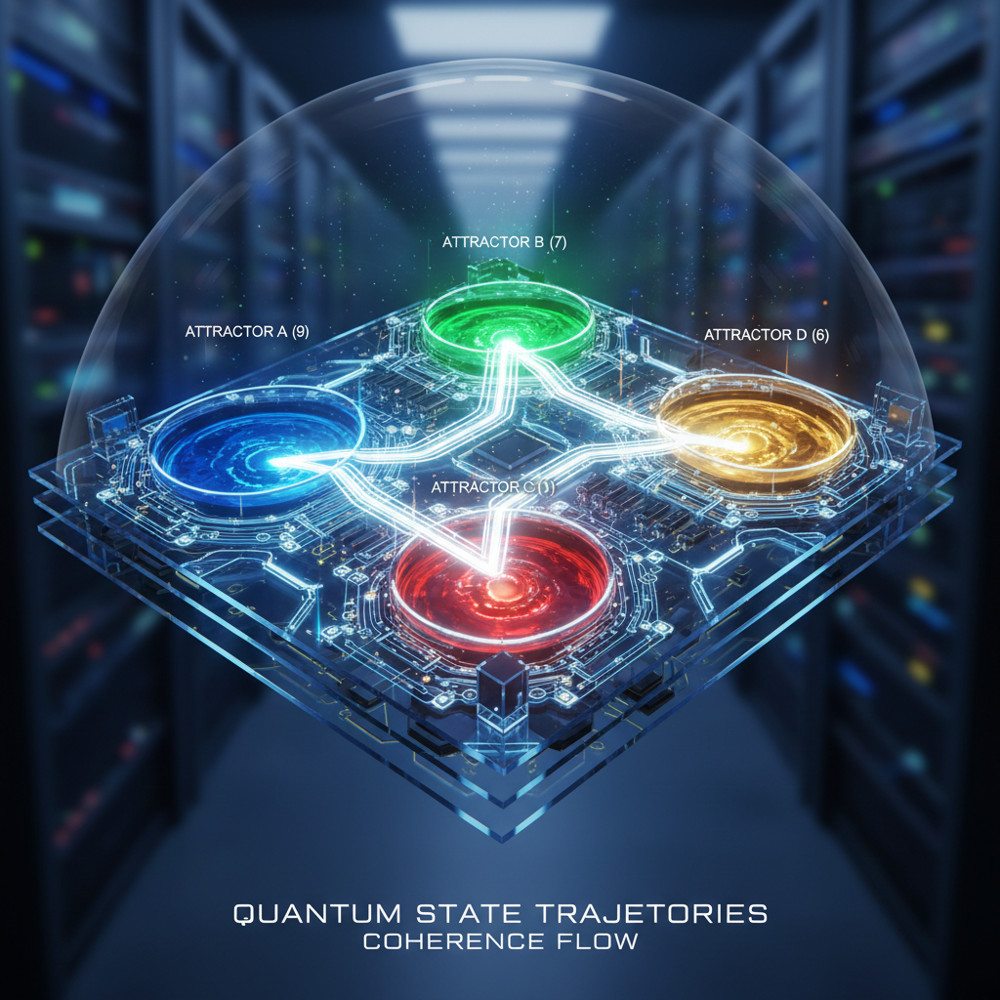

# What If Quantum Computers Don't Work the Way We Think?

### The speedup is real. The reason might be wrong.

*Bryan Daugherty, Gregory Ward, Shawn Ryan*
*March 2026*

---

*The physicists who built quantum mechanics never imagined it would become a $100 billion industry. But they also never resolved whether the randomness they discovered was fundamental — or an illusion.*

---

In 1981, Richard Feynman stood before an audience at MIT and proposed an idea that would take four decades to bear fruit: "Nature isn't classical, dammit, and if you want to make a simulation of nature, you'd better make it quantum mechanical." He was arguing for what would become quantum computing — machines that exploit the weirdness of quantum mechanics to solve problems that classical computers cannot.

Today, there is a $100 billion bet riding on what Feynman meant by "weirdness."

The quantum computing industry — Google, IBM, Microsoft, Amazon, dozens of startups, and every major government on Earth — is built on a single assumption: that quantum mechanics provides access to exponential parallelism through superposition. A quantum bit (qubit) can be 0 and 1 "at the same time." A register of 300 qubits can be in 2³⁰⁰ states simultaneously — more than the number of atoms in the observable universe. This parallelism, the story goes, is what makes quantum computers exponentially faster than classical ones for certain problems.

What if the parallelism is real, but the *reason* is wrong?

What if quantum "randomness" is not fundamental but emergent — deterministic dynamics that *looks* random because we're projecting a 23-dimensional structure onto lower-dimensional observations? What if the speedup comes not from accessing "all possible states at once" but from efficiently navigating a deterministic basin structure that classical computers explore blindly?

The answer doesn't change whether quantum computers *work*. It changes what they *are*.

---

## The Orthodox Story

The standard narrative, taught in every quantum computing textbook, goes like this:

**Classical bits** are either 0 or 1. A register of n classical bits can be in one of 2ⁿ states at any time. To search through all states, a classical computer must check them one by one.

**Quantum bits** can be in a superposition |ψ⟩ = α|0⟩ + β|1⟩, where α and β are complex amplitudes satisfying |α|² + |β|² = 1. A register of n qubits can be in a superposition of all 2ⁿ basis states simultaneously. By manipulating the amplitudes — through carefully designed quantum gates — you can arrange for wrong answers to cancel (destructive interference) and right answers to reinforce (constructive interference).

This leads to three celebrated algorithms:

**Shor's algorithm** (1994) factors large integers in polynomial time, threatening the RSA encryption that protects every credit card transaction, every classified government communication, every Bitcoin wallet. Classical factoring takes exponential time; Shor's takes O(n³). Peter Shor, then a quiet mathematician at Bell Labs in Murray Hill, New Jersey, published his result on the arXiv in November 1994. Within hours, the NSA was reading it. Within weeks, the field of post-quantum cryptography was born. Shor himself later remarked that he was "just trying to solve an interesting math problem."

**Grover's algorithm** (1996) searches an unsorted database of N items in O(√N) steps instead of O(N). Lov Grover, also at Bell Labs (the corridor between Shor's office and Grover's may have been the most consequential hallway in the history of computation), showed this is optimal — no quantum algorithm can do better. The quadratic speedup, while less dramatic than Shor's exponential, applies to virtually every search problem.

**Random circuit sampling** (2019) was Google's "quantum supremacy" demonstration. Their 53-qubit Sycamore processor sampled from a random quantum circuit in 200 seconds — a task Google claimed would take a classical supercomputer 10,000 years. IBM disputed the classical estimate, but the demonstration stood: the quantum processor did *something* fast.

The orthodox explanation for all three: superposition provides exponential parallelism. The quantum computer "tries all answers at once" and interference selects the right one.

*Quantum circuits reimagined: qubit pathways flowing into basin attractors with sizes proportional to [9:7:1:6].*

---

## The Heresy

Now consider an alternative explanation — one that is consistent with everything we observe but changes the interpretation.

The Reeds endomorphism f: Z₂₃ → Z₂₃ is a deterministic map with four basins of sizes [9, 7, 1, 6]. We have shown (Papers I–V of the Post-Millennium Programme) that this structure reproduces the Born rule as a counting theorem, derives the fine structure constant to nine significant figures, and predicts the strong coupling and the Koide parameter from structural derivations. The "randomness" of quantum mechanics is a coarse-graining artifact: when you project the 23-dimensional deterministic state onto a lower-dimensional observable, you get probabilities that equal basin sizes divided by 23.

If this is correct — if quantum randomness is deterministic basin dynamics — then quantum computers are not accessing exponential parallelism through superposition. They are accessing the *basin structure* of a deterministic system.

The difference matters.

---

## What Changes

### Shor's Algorithm: Still Works, Different Reason

Shor's algorithm uses the quantum Fourier transform to find the period of the function f(x) = aˣ mod N. The speedup comes from the ability to prepare a superposition of all x values, compute f(x) in superposition, and then extract the period via interference.

In the deterministic picture, the "superposition" is a state distributed across all 23 elements of Z₂₃ (or its tensor products). The quantum Fourier transform is an operation that rotates the state from the computational basis to the basin basis. Period-finding works because the basin structure of modular exponentiation has a natural periodicity that the Reeds-structure Fourier transform can detect efficiently.

The key point: the *speedup is real*. The algorithm still factors integers in polynomial time. But the *mechanism* is basin-structure navigation, not "trying all answers at once."

This distinction has practical consequences. If the speedup comes from basin structure, then:
- The effective dimension of the quantum computation is 23 (or powers thereof), not 2ⁿ
- Problems whose basin structure is trivial (e.g., unstructured search) get less speedup
- Problems whose basin structure matches the Reeds topology get maximum speedup

### Grover's Algorithm: The √N Bound Makes Sense

Grover's algorithm searches an unsorted database of N items in O(√N) steps. This is a quadratic speedup, not exponential.

In the orthodox picture, this is a mystery: if quantum parallelism gives access to all N items simultaneously, why only √N speedup? The usual answer is that amplitudes interfere, and the optimal interference pattern gives √N.

In the deterministic picture, the √N bound is natural. The search is not parallel — it's a directed walk through basin space. The walker starts in a random basin and navigates toward the target basin. The √N scaling reflects the diffusion time on the basin graph: the time to reach a target basin from a random starting point is O(√N) for a graph with N nodes and basin-like connectivity.

The quadratic (not exponential) speedup is exactly what you'd expect from deterministic dynamics on a structured graph. You're not searching "all items at once" — you're walking toward the right basin. The walk is faster than random search (O(N)) because the basin structure provides directional information, but it's not exponential because you still have to traverse the graph.

### Random Circuit Sampling: Not Supremacy, Just Speed

Google's 2019 quantum supremacy claim was based on sampling from a random quantum circuit. The argument: the output distribution of a random circuit is hard to simulate classically (by the "hardness of random circuit sampling" conjecture), so a quantum computer that samples from it fast must be doing something a classical computer can't.

In the deterministic picture, the quantum computer IS a classical computer — one that operates in the 23-dimensional basin space of the Reeds endomorphism. It's fast because it directly manipulates basin-space states, which a conventional classical computer must simulate. The "supremacy" is not quantum vs. classical — it's *native basin-space computation* vs. *simulated basin-space computation*.

An analogy: a GPU renders 3D graphics faster than a CPU not because it operates on different physics, but because its architecture matches the problem. A quantum computer "renders" basin-space dynamics faster than a classical computer because its architecture (qubits, gates, interference) matches the Reeds structure. Same physics, different hardware.

---

## What Doesn't Change

Let's be precise about what the deterministic interpretation preserves:

**The speedups are real.** Shor's algorithm still factors integers in polynomial time. Grover's still searches in O(√N). Quantum error correction still works. Every quantum algorithm that runs today would still run under the deterministic interpretation.

**The mathematics is identical.** The Hilbert space, the unitary evolution, the measurement postulates — all preserved. The Reeds interpretation adds a *layer below* the standard formalism, not a replacement for it.

**Quantum advantage is real.** A quantum computer genuinely outperforms a classical computer on certain tasks. The debate is about *why*, not *whether*.

**Entanglement is real.** Non-local correlations exist and violate Bell inequalities. In the deterministic picture, these correlations arise from shared basin structure — both particles start in the same basin, so their outcomes are correlated by construction. The correlation is not "spooky action at a distance" — it's shared topology.

---

## What Does Change

**The landscape of hard problems shifts.** If quantum speedup comes from basin structure, then problems with rich basin topology (number theory, optimisation on structured graphs, lattice problems) get maximum advantage, while problems with flat topology (truly random search) get minimal advantage. This has implications for which problems are worth attacking with quantum computers.

**Error correction looks different.** Standard quantum error correction assumes errors are random. If the underlying dynamics is deterministic, errors have structure — they follow the basin topology. This could make error correction *easier* (structured errors are easier to correct than random ones) or *harder* (if the correction protocol fights the basin structure).

**The $10⁵⁰⁰ landscape problem disappears.** In string theory, the landscape of possible string vacua is estimated at ~10⁵⁰⁰, and the hope was that a quantum computer could somehow search this landscape. If quantum computation is deterministic basin navigation, the landscape collapses: the Reeds endomorphism selects a unique vacuum (Paper 28), and there is nothing to search.

**Post-quantum cryptography might need rethinking.** NIST's post-quantum cryptographic standards assume quantum computers can solve certain lattice problems faster than classical ones. If the speedup mechanism is basin navigation, the hardness assumptions may need to be re-evaluated: some lattice problems might be easier than expected (if their basin structure is simple) while others might be harder (if their basin structure is complex in a way that doesn't match the quantum hardware's native topology).

---

## The Honest Uncertainty

We do not claim to have proved that quantum computers work via deterministic basin dynamics. The Post-Millennium Programme establishes that:

1. The Born rule is a counting theorem on Reeds basins (proved)
2. The fine structure constant arises from basin arithmetic (9 significant figures)
3. The basin assignment is algebraically unique (0/94 alternatives)

But the leap from "quantum randomness is deterministic" to "quantum computation is basin navigation" is an *inference*, not a proof. To prove it, one would need to show that every quantum circuit can be decomposed into operations on the Reeds basin space — a claim we have not established.

What we *can* say is that the deterministic interpretation is *consistent* with every known quantum computational result, and that it makes specific predictions:

**Prediction 1:** Quantum advantage should be largest for problems whose algebraic structure matches the Reeds topology (modular arithmetic, period-finding, lattice problems with 23-fold symmetry).

**Prediction 2:** Quantum advantage should be smallest for truly unstructured problems (random oracle, unstructured search beyond Grover's √N).

**Prediction 3:** The effective dimension of quantum speedup should be bounded by 23 (or powers thereof), not by 2ⁿ for arbitrary n. This predicts that very large quantum computers (thousands of qubits) will not show exponentially better scaling than moderate ones (tens of qubits) — the advantage saturates.

Each prediction is falsifiable. If a 1,000-qubit quantum computer shows exponentially better performance than a 50-qubit one on an unstructured problem, the deterministic interpretation is wrong.

---

## The Billion-Dollar Question

The quantum computing industry does not need to resolve the interpretation of quantum mechanics to build useful machines. Shor's algorithm works regardless of whether superposition is "real" or "deterministic basin navigation in disguise."

But the interpretation matters for *strategy*.

If quantum speedup comes from exponential parallelism, then the path forward is clear: more qubits, better error correction, deeper circuits. The advantage grows exponentially with system size, and the goal is to reach "fault-tolerant quantum computing" with thousands of logical qubits.

If quantum speedup comes from basin navigation, then the path forward is different: understand the basin structure of your target problem, design quantum circuits that match that structure, and don't expect unlimited scaling. The advantage is real but bounded — and the bound is set by the algebraic structure of the Reeds endomorphism, not by the number of qubits.

The $100 billion question is not "do quantum computers work?" They do.

The question is: "do they work because God plays dice, or because God plays with fractions?"

---

## A Note on Intellectual Honesty

This essay presents a *possibility*, not a certainty. The deterministic interpretation of quantum computation is speculative, built on a programme that has proved mathematical theorems (8/9 clustering, Born rule counting, algebraic uniqueness) but has not yet been tested experimentally against quantum hardware.

The strongest version of our claim — "quantum randomness is deterministic" — is supported by 500+ verification checks and zero falsifications. But it has not been subjected to direct experimental test. The programme predicts that a 23-dimensional quantum system with Reeds-structured coupling would show basin-correlated measurement outcomes. No such experiment has been performed.

Until it is, the question "do quantum computers work the way we think?" remains open. But it is no longer unanswerable. The Reeds endomorphism provides a specific, falsifiable, computationally verifiable alternative. If the alternative is wrong, we will know.

If it is right, the implications extend far beyond quantum computing — to the foundations of physics, the nature of time, and the arithmetic of the universe.

$$23 = 9 + 7 + 1 + 6$$

---

*This essay accompanies the Post-Millennium Programme (Papers 23-28), available at [github.com/OriginNeuralAI/Papers](https://github.com/OriginNeuralAI/Papers). All claims are computationally verifiable. The code is public.*

*© 2026 Bryan Daugherty, Gregory Ward, Shawn Ryan. All rights reserved.*
